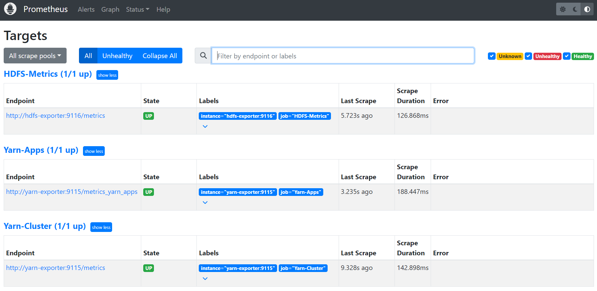
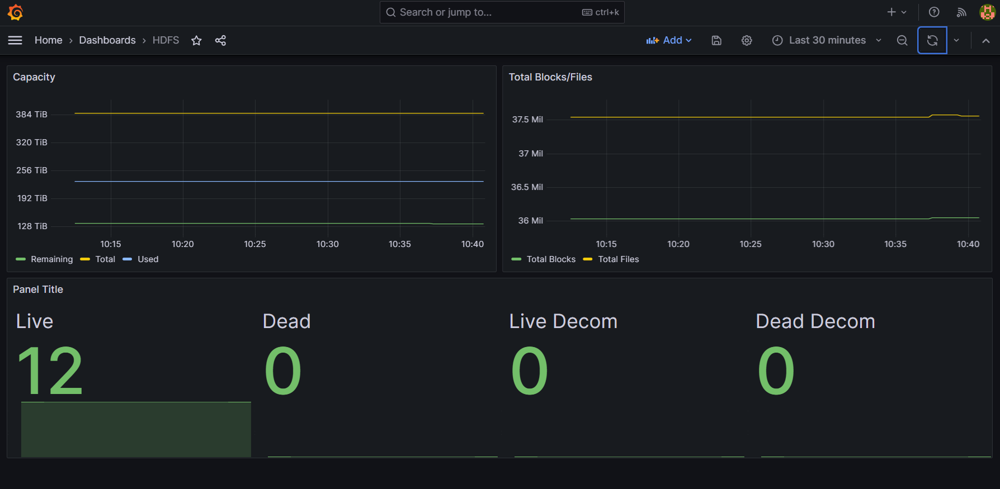
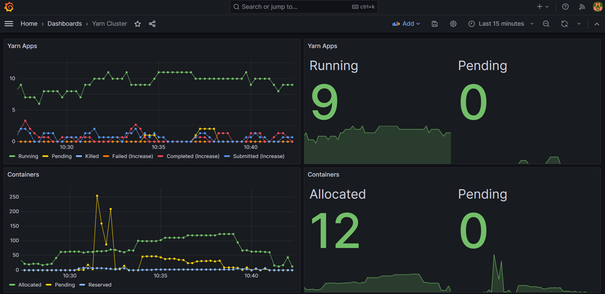
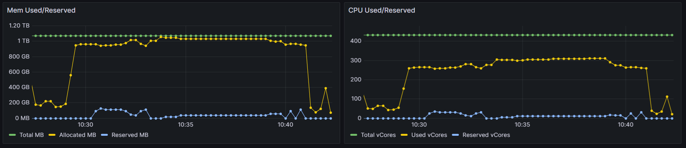
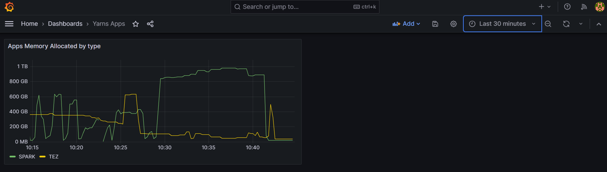

# HadoopObs
Proyecto de observabilidad de Hadoop (YARN/HDFS) por medio de sus APIs.

## Pasos
### Definir la variable de ambiente YARN_API_URL
```bash
export YARN_API_URL=http://miServidor:miPuerto
export HDFS_API_URL=http://miServidor:miPuerto
```
### Ejecutar Docker Compose
```bash
docker compose up
```

## Images
### Promethues


### Grafana
#### HDFS

#### YARN




## Contacto
Zacarias Daniel Apaza
email: zacancion@gmail.com
Linkedin: https://www.linkedin.com/in/zacariasapaza/
